# AudienceDecode-317971

**Team Members:**
- Arianna Cambi, 317971
- Sofia Capriolo, 309371
- Andrea Cipolla, 319211
- Giorgio Vanini, 311581

---

## Section 1: Introduction

Audience Decode analyzes viewer engagement and content dynamics within a large-scale streaming platform using the `viewer_interactions.db` dataset, which contains approximately 100 million anonymized user-movie interactions spanning 434,429 users and 10,000 movies. Each interaction includes a rating on a **7-point scale (0-6, where 0=lowest, 6=highest)**, timestamp, and associated metadata. Rather than predicting individual ratings, this project focuses on uncovering behavioral patterns through unsupervised learning to segment audiences and content into interpretable categories.

We perform clustering separately on two pre-aggregated feature sets: **user engagement profiles** (total ratings given, average rating, rating variability, unique movies watched, activity duration) and **movie reception profiles** (total ratings received, average rating, rating dispersion, unique users reached). Using systematic evaluation across k ∈ [3, 9], we identify k=4 user 
segments and k=3 movie categories through centroid silhouette analysis 
and elbow method consensus. We then select MiniBatch K-Means as the 
optimal algorithm by comparing cluster quality, balance, and computational 
efficiency across the three methods.
 By combining these segmentations, we construct a **4×3 user-cluster × movie-cluster preference matrix**, where each cell represents the average quality-weighted affinity between an audience segment and a content category. This dual-clustering framework reveals structured preference patterns, such as which user types favor high-engagement blockbusters versus niche critically-acclaimed films, without requiring labeled training data.

This approach offers three key advantages over traditional collaborative filtering:
1. **Interpretability**: Cluster centroids provide explicit behavioral profiles (e.g., "casual viewers" vs "power users") rather than latent factors
2. **Scalability**: Aggregated statistics reduce dimensionality from 100M interactions to ~440K samples, enabling efficient computation
3. **Cold-start robustness**: New users/movies can be assigned to clusters based on initial statistics without requiring extensive interaction history

The resulting insights support data-driven content curation, recommendation strategy design, and audience segmentation for targeted marketing campaigns.

---

## Section 2: Methods

### Dataset and Features

The dataset `viewer_interactions.db` is a relational SQLite database containing four tables:
- **viewer_ratings**: Interaction-level data (user ID, movie ID, rating 0-6, timestamp)
- **movies**: Movie metadata (movie ID, title, year of release)
- **user_statistics**: Aggregated user profiles with 5 features:
  - `total_ratings`: Total number of ratings given by the user
  - `avg_rating`: Average rating value
  - `std_rating`: Standard deviation of ratings (preference variability)
  - `unique_movies`: Number of distinct movies rated
  - `activity_days`: Time span between first and last rating
- **movie_statistics**: Aggregated movie profiles with 4 features:
  - `total_ratings`: Total number of ratings received
  - `avg_rating`: Average rating value
  - `std_rating`: Rating dispersion (polarization indicator)
  - `unique_users`: Number of distinct users who rated the movie

**Feature Selection Rationale**: We retained both `total_ratings` and `unique_movies/unique_users` 
despite their high correlation (>0.9) because they capture distinct behavioral concepts: `total_ratings` 
measures interaction *volume*, while `unique_movies/unique_users` measures engagement *breadth*. 
For example, two users may have the same total_ratings, but one rates many distinct movies (explorer 
behavior) while another rates fewer titles repeatedly (focused/rewatcher). Since our goal is 
interpretative clustering rather than predictive modeling, multicollinearity is not problematic, keeping 
both dimensions enriches cluster profiling semantically without affecting distance-based separation.

### Preprocessing Pipeline

1. **Data Cleaning**:
   - Removed records with missing keys or invalid ratings
   - Filtered anomalous timestamps
   - Dropped duplicate entries
   - Imputed missing `year_of_release` with median

2. **Feature Engineering**:
   - Reconstructed `activity_days` from `first_rating_days` and `last_rating_days` to preserve users with missing values
   - Capped extreme outliers (>99th percentile) in user engagement metrics to reduce skewness

3. **Imputation and Scaling**:
   - Applied median imputation to all numeric features in statistics tables
   - Standardized features using `StandardScaler` to ensure equal contribution during clustering

### Clustering Algorithms

We evaluated three scalable centroid-based methods on both user and movie feature matrices:

1. **K-Means**: Standard Lloyd's algorithm (`n_init=10`, `max_iter=300`)
2. **MiniBatch K-Means**: Optimized for large datasets (`batch_size=10000`, `n_init=5`)
3. **BIRCH**: Tree-based incremental clustering (`threshold=0.5`, `branching_factor=50`)

**Algorithm Selection Rationale**: All three are centroid-based and scalable. K-Means serves as baseline, MiniBatch K-Means addresses computational efficiency for 400K+ users, and BIRCH tests hierarchical clustering with different sensitivity to data geometry and outliers.

### Model Selection Strategy

Our model selection process follows a two-step procedure to ensure both optimal cluster granularity and algorithm performance.

#### Step 1: Optimal k Selection

For each algorithm (K-Means, MiniBatch K-Means, BIRCH) and dataset (users/movies), we tested k ∈ [3-9] and computed:

- **WCSS (Within-Cluster Sum of Squares)**: Compactness metric evaluated using the Elbow method to identify diminishing returns in variance reduction
- **Centroid-Based Silhouette**: Scalable separation quality proxy measuring how well each sample fits its assigned cluster compared to neighboring clusters

**Rationale for k-range selection**: Although the Elbow curves of the three methods do not show a very sharp "elbow", we intentionally restricted the search range to small k values (3-9) to maintain interpretability, reduce computational cost, and avoid over-fragmentation. In cases where WCSS decreases smoothly, the Elbow criterion can be ambiguous, so we complement it with the centroid-based Silhouette score. In our results, the Silhouette clearly peaks at small k (≈4 for users, ≈3 for movies), indicating that increasing k further, while potentially showing a clearer "elbow", would mainly fragment clusters without improving separation quality. For these reasons, the chosen k-range balances model complexity with practical interpretability.

We selected the global k using a **consensus rule**:
- **If ≥2 models agreed** on the best k (by centroid silhouette) → adopt that k via **majority vote**
- **If all 3 models suggested different k** → choose k with the **highest average silhouette** across all models

Visual confirmation with elbow plots ensured the selected k represented a meaningful trade-off between model complexity and cluster compactness.

#### Step 2: Algorithm Selection

After determining the optimal k for each dataset, we ranked the three clustering algorithms using a **composite score** combining:

1. **Cluster quality**: Centroid silhouette at the optimal k (higher is better)
2. **Cluster balance**: 
   - Minimum cluster size (larger is better, avoids singleton/tiny clusters)
   - Standard deviation of cluster sizes (lower is better, avoids severe imbalance)
3. **Computational efficiency**: Execution time (lower is better for scalability)

Each metric was normalized and weighted to produce a final ranking score. This multi-criteria approach ensures the selected model balances separation quality, interpretability (balanced clusters), and practical deployment considerations (computation time).

### Preference Matrix Construction

After identifying the optimal k for both datasets (k=4 for users, k=3 for movies), we selected **MiniBatch K-Means** as the best-performing algorithm based on its superior composite score (see Section 4 for detailed performance comparison). Using the cluster assignments from this model, we constructed the preference matrix as follows:

1. **Assigned each movie a quality score**: normalized(`avg_rating`) + normalized(`log(total_ratings)`)

2. **Computed cluster-level affinity** for each (user cluster, movie cluster) pair based on historical ratings and interaction counts

3. **Combined affinity and quality** into a final preference score using weights α=0.6 (affinity) and γ=0.4 (quality)

4. **Visualized the resulting preference matrix** via heatmap to identify systematic preference patterns

### Machine Learning System Workflow

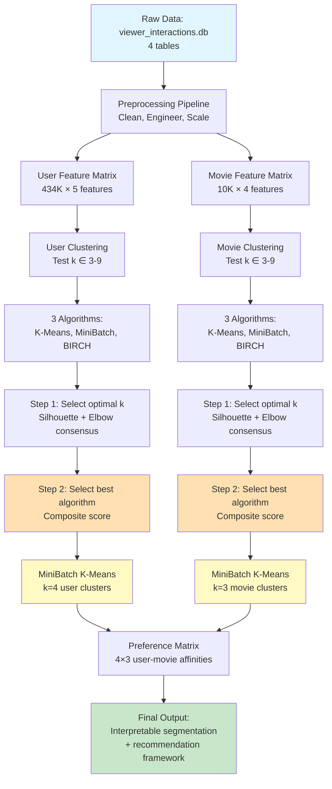

### Environment Setup

The analysis was conducted using Python 3.x with the following core dependencies:
- `pandas`, `numpy`: Data manipulation
- `scikit-learn`: Clustering algorithms, preprocessing, PCA
- `matplotlib`, `seaborn`: Visualization
- `sqlite3`: Database connection

All dependencies are listed in `requirements.txt` for reproducibility

### Design Choices Summary

- **Median imputation over mean**: Robust to outliers in heavily skewed distributions

- **Capping at 99th percentile over removal**: Preserves data while reducing extreme skew effects

- **StandardScaler**: Ensures features with different scales (e.g., total_ratings vs std_rating) contribute equally

- **Centroid-based algorithms**: Chosen for scalability and interpretability on large datasets

- **Composite scoring for model selection**: Evaluates cluster quality, cluster size distribution, and computational efficiency rather than optimizing a single metric

---
## Section 3: Experimental Design

### Purpose

The primary goal is to identify optimal clustering configurations for both users and movies that balance three criteria: (1) separation quality (how distinct the clusters are), (2) cluster balance (avoiding tiny or singleton clusters), and (3) computational efficiency. We aim to uncover interpretable behavioral segments rather than maximize a single performance metric.

### Baselines

We compare three centroid-based clustering algorithms as baselines:

1. **K-Means**: Standard Lloyd's algorithm serving as the reference baseline
2. **MiniBatch K-Means**: Scalable variant designed for large datasets (400K+ users)
3. **BIRCH**: Hierarchical clustering with different sensitivity to data geometry

Each baseline is evaluated across k ∈ [3-9] to explore different granularities of segmentation.

### Evaluation Metrics

We employ a multi-metric evaluation framework:

- **WCSS (Within-Cluster Sum of Squares)**: Measures cluster compactness via the Elbow method. Lower values indicate tighter clusters.
- **Centroid-based Silhouette**: Scalable approximation of the standard Silhouette score (O(nk) vs O(n²)), measuring separation quality by comparing intra-cluster cohesion to nearest-cluster distance using centroids as proxies.
- **Cluster size distribution**: Minimum cluster size and standard deviation detect severe imbalance (e.g., singleton clusters or highly skewed distributions).
- **Computation time**: Practical efficiency consideration for large-scale deployment.

**Why these metrics?** WCSS and Silhouette provide complementary views (compactness vs separation), while size distribution and time ensure the solution is practical and interpretable. We combine these into a composite ranking score to avoid over-optimizing a single dimension, ensuring the selected model balances quality, balance, and efficiency.

---

## Section 4: Results

### Exploratory Data Analysis

Before clustering, we analyzed the distribution of user engagement metrics and feature correlations to understand the data structure.

**Figure 1**: Distribution of user engagement metrics showing heavy-tailed behavior with most users having low activity and a small fraction showing extreme engagement.

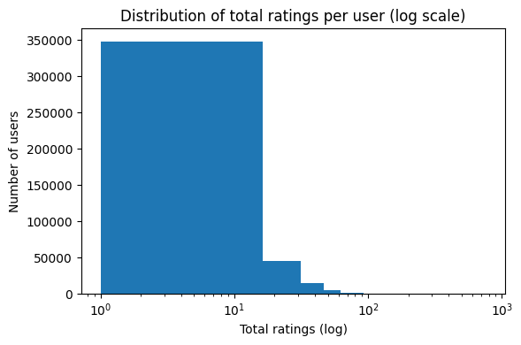

*Generated from EDA code in main.ipynb - Section 1.1.2*

---

**Figure 2**: Correlation heatmap of user features revealing strong correlation (0.94) between total_ratings and unique_movies, confirming statistical redundancy but justifying retention for semantic distinction.

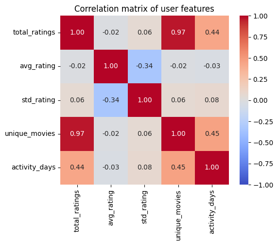

*Generated from EDA code in main.ipynb - Section 1.1.6*

---

### Model Performance Comparison

We evaluated three clustering algorithms (K-Means, MiniBatch K-Means, BIRCH) across k ∈ [3-9] using centroid silhouette analysis and elbow method consensus. The optimal k was identified as **k=4 for users** and **k=3 for movies**. We then ranked the algorithms using the composite score described in Section 2.

**Table 1: Clustering Algorithm Comparison - Movies (k=3)**

| Model             | Centroid Silhouette | Min Cluster Size | Std Cluster Size | Time (sec) | Score  |
|-------------------|---------------------|------------------|------------------|------------|--------|
| MiniBatch K-Means | 0.536               | 3,689            | 1,375.02         | 0.162      | 1.000  |
| K-Means           | 0.524               | 19               | 4,253.67         | 0.169      | -0.333 |
| BIRCH             | 0.814               | 14               | 7,493.47         | 0.178      | -0.667 |

**Table 2: Clustering Algorithm Comparison - Users (k=4)**

| Model             | Centroid Silhouette | Min Cluster Size | Std Cluster Size | Time (sec) | Score |
|-------------------|---------------------|------------------|------------------|------------|-------|
| K-Means           | 0.434               | 54,988           | 53,069.01        | 4.919      | 0.000 |
| MiniBatch K-Means | 0.437               | 54,538           | 48,731.98        | 5.252      | 0.000 |
| BIRCH             | 0.481               | 655              | 164,498.51       | 4.612      | 0.000 |

**Interpretation**: MiniBatch K-Means achieves the best overall balance between cluster quality, size distribution, and computational efficiency. For movies, it clearly outranks competitors with a composite score of 1.000, producing well-balanced clusters (min size = 3,689) and good separation (silhouette = 0.536). For users, MiniBatch K-Means and K-Means achieve identical composite scores (0.000) due to ties in the ranking system, but MiniBatch K-Means is selected as the preferred model due to its slightly higher silhouette score (0.437 vs 0.434) and better cluster size balance (lower std = 48,732 vs 53,069), despite marginally longer execution time. BIRCH attains the highest silhouette scores in both cases but produces extremely imbalanced clusters (very small minimum cluster sizes: 14 for movies, 655 for users), significantly reducing interpretability and practical utility.

---

**Figure 3**: Elbow and Centroid Silhouette curves for user clustering across k ∈ [3-9]. The three algorithms show different optimization patterns, with Silhouette peaking around k=4 for K-Means and MiniBatch K-Means, while BIRCH exhibits distinct behavior.

**K-Means:**

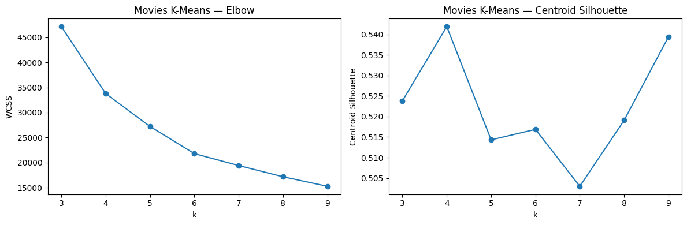

**MiniBatch K-Means:**

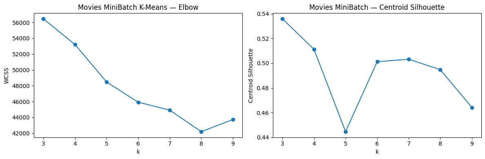

**BIRCH:**

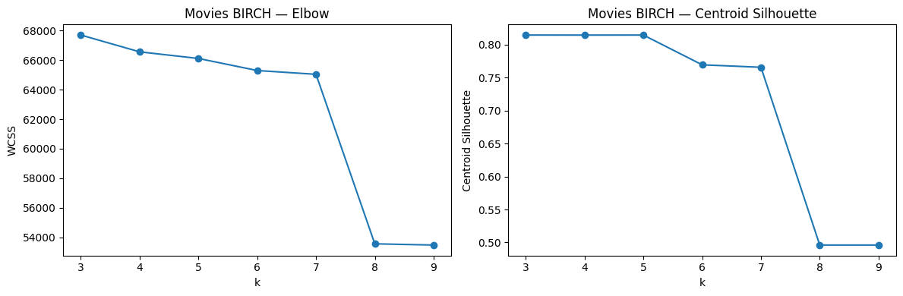

*Generated from clustering evaluation code in main.ipynb - Section 4.2, 4.3, 4.4*

---

**Figure 4**: Elbow and Centroid Silhouette curves for movie clustering across k ∈ [3-9], showing optimal k=3 selection through consensus across the three algorithms.

**K-Means:**

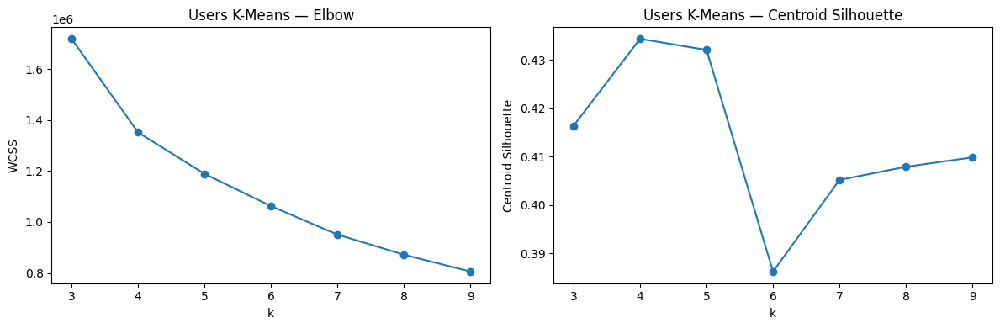

**MiniBatch K-Means:**

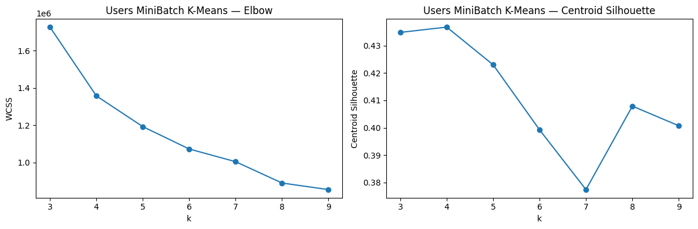

**BIRCH:**

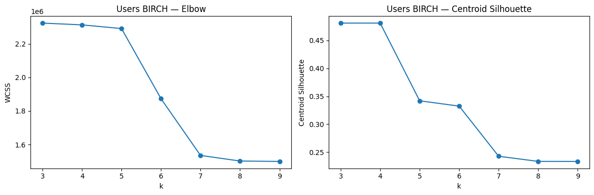

*Generated from clustering evaluation code in main.ipynb - Section 5.1, 5.2, 5.3*

---

**Figure 5**: 2D PCA projection of user clusters from MiniBatch K-Means (k=4). Clusters show partial overlap in reduced space (expected given high-dimensional original feature space) but maintain clear centroid separation.

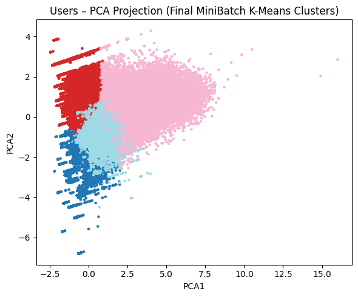

*Generated from visualization code in main.ipynb - Section 4.6*

---

**Figure 6**: 2D PCA projection of movie clusters from MiniBatch K-Means (k=3), visualizing content segmentation in reduced dimensional space.

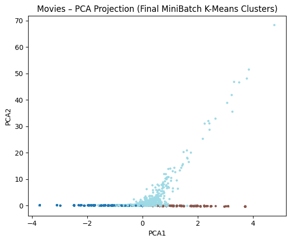

*Generated from visualization code in main.ipynb - Section 5.5*

---

### User Segmentation

Using the selected model (MiniBatch K-Means with k=4), we identified four distinct user behavioral profiles based on their engagement patterns and content preferences:

- **U0 — Selective Mainstream Explorers**: Preferences concentrate on F1 (0.50) and F2 (0.44), with very low alignment with F0 (0.05), indicating a focused preference profile that strongly deprioritizes marginal content

- **U1 — High-Engagement Quality Seekers**: Strongest overall preference intensity, with F2 (0.84) and F1 (0.77) clearly dominant and F0 (0.10) remaining weak

- **U2 — Casual Quality-Oriented Viewers**: Similar ranking to U1 but with lower intensity: F2 (0.79) > F1 (0.59) >> F0 (0.08)

- **U3 — Highly Selective Critics**: Most restrictive pattern toward F0 (0.00), while still showing clear preference for F2 (0.72) and F1 (0.56)

---

### Movie Segmentation

Using the selected model (MiniBatch K-Means with k=3), we identified three distinct movie categories based on reception patterns and audience reach:

- **F0 — Low-Attraction Marginal Content**: Movies with consistently low appeal (low avg_rating, low total_ratings) and limited audience reach (small unique_users), representing niche or poorly-received content that fails to attract significant engagement

- **F1 — Mainstream Popular Titles**: Widely consumed movies with moderate-to-high popularity (high total_ratings, broad unique_users) and solid average ratings, representing commercially successful content with broad appeal

- **F2 — Top-Quality High-Engagement Movies**: Movies combining both high perceived quality (high avg_rating) and strong audience engagement (high total_ratings, large unique_users), representing critically acclaimed blockbusters and platform flagship content

---

### Preference Patterns

By combining user and movie cluster assignments, we constructed a preference matrix revealing systematic affinities between audience segments and content categories:

- F2 (Top-Quality High-Engagement Movies) emerges as the most consistently preferred category across all user groups
- F0 (Low-Attraction Marginal Content) is systematically avoided, with near-zero preference scores (0.00-0.10) across all segments
- User clusters differentiate primarily in preference intensity rather than ranking order

**Figure 7**: User-cluster × Movie-cluster preference matrix heatmap. Cell values represent preference scores combining cluster-level affinity (α=0.6) and movie cluster quality (γ=0.4). Clear block structures validate meaningful segmentation beyond random assignment.

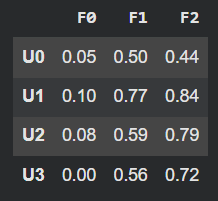

*Generated from preference analysis code in main.ipynb - Section 6*

---

## Section 5: Recommendation System Extension

We implemented an additional, fully interpretable recommendation module that operationalizes the user–movie cluster structure described above (implemented in main.ipynb, Section 7). The goal of this extension is to demonstrate how our clustering framework can support transparent Top-N suggestions.

The system uses four inputs:

- (i) the user's assigned cluster,
- (ii) the movie cluster labels,
- (iii) a **movie quality score** (normalized average rating + normalized log total_ratings), and
- (iv) a **cluster-level affinity matrix** that measures how strongly each user cluster historically engages with each movie cluster. 

For efficiency, these values are pre-computed into lookup dictionaries (e.g. {(user_cluster, movie_cluster) → affinity}, {movie_id → quality}, {user_id → set(movies_seen)}), enabling constant-time retrieval during scoring.

For a given user, we define a scoring function that combines:
- **Affinity** between the user's cluster and the movie's cluster (weight α = 0.6)
- **Global movie quality** independent of user behavior (weight γ = 0.4)

Already-seen titles are filtered out, the score is computed for all remaining candidates, and the **Top-10 movies are returned**. Because all inputs are directly observable, the recommendations are fully explainable (e.g., "users similar to you like this type of movie" + "this movie scores highly overall").

During development, we implemented two alternative presentation modes:
- (i) **Interactive mode** – all valid user IDs are printed and the analyst can manually select one user to view the Top-10 recommendations
- (ii) **Report-style mode** – a compact version showing examples for a curated subset of users

Both modes produce identical recommendations. Option (ii) was selected as the primary output format for clarity and conciseness in documentation.

## Section 6: Conclusions

This project shows that unsupervised clustering can decode audience–content relationships in streaming data and provide interpretable segments for recommendation design and content strategy. The dual-clustering framework (4 user segments, 3 movie categories) yields clear preference patterns, with high‑quality, high‑engagement movies emerging as the most attractive category and marginal content being systematically avoided across all groups.

However, several limitations remain. First, the analysis relies on aggregated historical ratings and does not model temporal dynamics, so it may miss short-term trends and changes in user tastes. Second, the preference matrix captures associations rather than causality, and the recommendation module may reinforce filter bubbles by repeatedly suggesting titles from the same preferred clusters. Third, the model uses only numerical interaction features and operates at cluster level: it ignores semantic content information (e.g., genre, narrative themes) and cannot fully capture fine‑grained individual preferences. Finally, cluster quality is sensitive to feature choices, preprocessing, and the selected algorithms, so different design decisions or datasets could lead to alternative yet equally plausible segmentations.

Future work could mitigate these issues by incorporating content and temporal features, adding diversity-aware recommendation criteria, and validating the discovered segments through user studies or controlled experiments.
